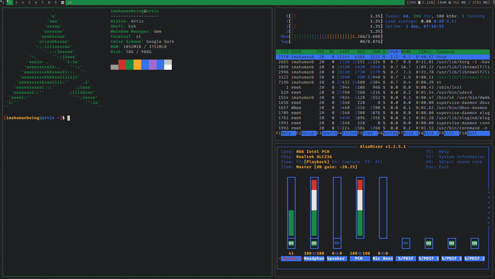

# green themed dwm


## recommendations
- install my fork of st too for this to look better
- dont be a complete linux noob
- install artix linux
- use a 1360x768 resolution

## installation

NOTE: this assumes you dont a have a display manager, you are using an arch derivative or arch itself and you have yay installed

```
sudo pacman -S feh
yay -S nerd-fonts-fira-code
git clone https://github.com/imahumanbeing-irl/dwm
cd dwm
mv .fonts.conf ~
sudo mv status /usr/bin/
rm ~/.config/neofetch/config.conf
mv config.conf ~/.config/neofetch/
cd ..
git clone https://github.com/Earnestly/sx
cd sx
make PREFIX=/usr install
cd ../dwm
mv sxrc ~/.config/sx/
sudo make install
```
edit ~/.config/sxrc to set your wallpaper (optional)


## patches
- fullgaps
